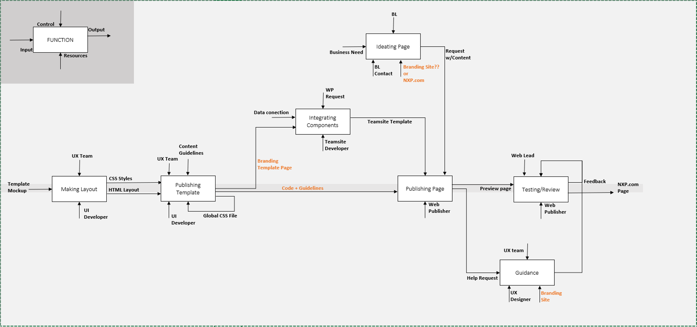
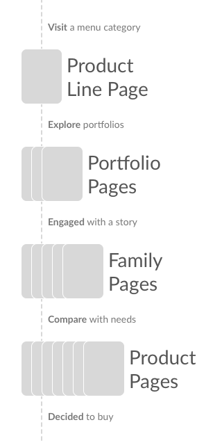
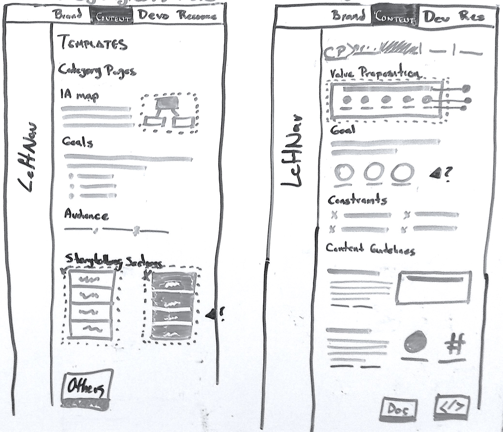
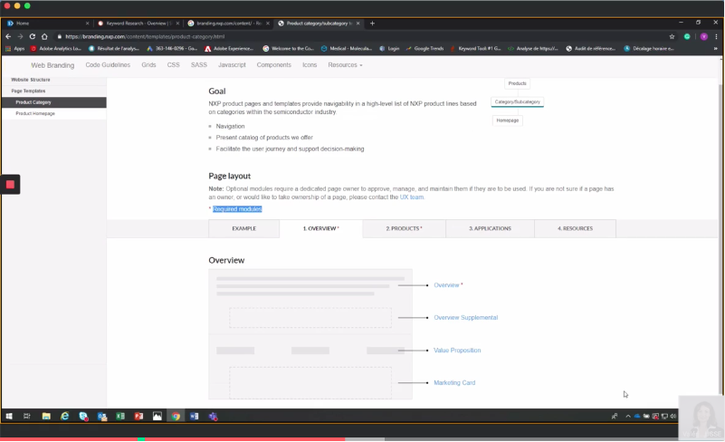

**Summary:** This is how our internal UX consultancy tasks were reduced by 80%.
After systematizing our UI designs and promoting the use of content guidelines.
All this, creating our design system's website.

### Giving you context

Every year we have a big amount of product launches. It means creating and
updating product pages or entire sections in our website. This is coordinated
with marketing, engineering and our (Online experience) department.

However, our internal publishing team **struggles with stakeholders' requests**.
They ask for features and placing content out of our website's standards.

And this team doesn't have arguments to discuss requirements, except to go
with us - The UX/UI internal team. We help them creating UI proposals **keeping
consistency on the look and feel** of our corporate website.

But we can't assist them as needed. This because we handle 10+ projects with the IT
department! And it delays our expected delivery time **up to 1 week after they asked**.

> In conclusion, we needed to empower publishing people and educate stakeholders with
> design and content guidelines in a single-source-of-true website.

---

# My process

### Iteration is key

It's usual for stakeholders who are out of design/development cycles, thinking
on a beautiful linear flow, but the UX process _should be_ circular.

Getting actionable insights from research, applying them in low/high fidelity
designs so they can be tested, getting stakeholders and users feedback to iterate
and start again.

But, to make this story easier for you to read, I divided the project into 5
well-known categories:

1. Strategy
2. Research
3. Prototyping
4. Development
5. Testing

---

# 1. Strategy

### Mini-creative brief

Key users of the solution:

- Marketing people (Europe and the USA)
- Product's engineers (Austin, TX)
- Web publishers (Guadalajara, MX)

Main scenarios:

- During virtual meetings
- Planning product's launches
- Discussing product pages redesign.

Business goals:

- Migrate all design documents to a standardized web format as a guidelines section
  on the **brand website**.
- Work on it as a side-project during Q2-Q3/2019.
- Reduce to the half the consultancy tasks.

Project's team:

- A Sr. UI developer (Austin, TX)
- Me, as UX designer lead (Guadalajara, MX)

---

# 2. Research

### Interviews and immersion

I interviewed around eight people with a set of process-oriented questions so I
could **map and understand the full picture**. In few words, I basically asked:

1. **Outputs**. What are your deliveries?
2. **Inputs**. What do you need to start?
3. **Resources**. What is essential for your work?
4. **Control**. Who are the decision-makers?
5. **Tasks**. How do you produce your deliveries?

And, to **empathize with their work**, I ran part of the process to be familiar with
'the how'.

  

I reduced the process to touchpoints, and as you can see there's **a lot of
resources delivered by different channels** to publishers.

  

We'd need to **reduce the touchpoints** at their left, making all transparent to them
so they could actively find what they need whenever they need it.

Also, while acting as a publisher I discovered what they needed the most:

- **Page templates** with mandatory and optional components.
- **Code** for recreating each component with approved variations.
- **Content guidelines** to fill each specific component.

---

> So, I realized my whole UX/UI team needed to evolve our UX practice to provide
> all in a systematic way!

---

### Matching business and customers with templates

I started at the highest level of our corporate website navigation. I classified
the **page templates** we needed according to the **product hierarchy** and the
**expected action** from our customers.

  
  <figcaption>
    Hierarchy based on the
    <a href="http://www.businessdictionary.com/" target="_blank">
      business dictionary
    </a>
    definitions.
  </figcaption>

### Modular pages

I classified the page template's parts inspired by the
[Atomic Design Methodology ](https://atomicdesign.bradfrost.com/chapter-2/)
since that would allow us to build a _library of patterns_.

Since we already counted with a style guide and a components collection, this was
the last step to complete our own **Design System**.

  

From now each **Page** would use:

- A **Template** according to a story to tell
  - Composed by **Sections** with a topic to cover
    - Built by **Modules** or **Components** as our design and development building blocks
      - Most of them made of HTML **Elements**

> Selling this as our evolution to a Design System made my UX/UI team commit to
> rework the existing designs and move to the modular pattern

---

# 3. Prototyping

### Information Architecture (IA)

I created a **site map of our old _brand website_**. I determined we had to delete a lot
of outdated content, keeping just essential code documentation, our style guide,
and components collection.

  

I proposed a new organization based on an **audience scheme, with a narrow and deep
hierarchy**:

- **Home.** Summarizing all the contents.
- **Brand.** Keeping our style guide and brand rules.
- **Content.** The _heart_ of this project to **help publishers and content creators**:
  The corporate website IA, page templates and their respective parts.
- **Developers.** Gathering the still valid code documentation.
- **Resources.** For third-party downloadable content.

  

We'd update the top-bar in the **header for global navigation and implement a new
left-bar for local navigation**, helping to find what they need.

### Sketches and wireframes

I started with low fidelity wireframes to place all the content considering the
intended user journey:

  

- **Step 1:** Where would my new page fit? - Corporate website IA

  - Tree of all corporate website areas: products, support, etc.
  - The company goal for each area.
  - Link to the respective page template.

- **Step 2:** How would it look? - Template page (Left drawing)

  - Page location according to the IA.
  - Intended customer goal at this point.
  - Audience (Type of customers).
  - Page template's interactive image.

- **Step 3:** What info should I include on it? - Section page (Right drawing)
  - Image displaying details.
  - Section's content goal.
  - Constraints: Do's and Dont's.
  - Content Guidelines
  - Download and view code buttons

After early feedback from the users. I tried
[Adobe XD ](https://www.adobe.com/products/xd/details.html?promoid=85665TVQ&mv=other%3Fpromoid&mv=other)
to **create the digital wireframes to be presented** to the UI developer and my manager.

  

I used [Invision Freehand ](https://www.invisionapp.com/feature/freehand)
so all could interact with the designs in the meeting, which helped us
to **add and remove ideas faster**, such as:

- Including links aside to the template's image, to scan better the page.
  Instead of the interactive image.
- Getting rid of the breadcrumb. Due to the development time and duplicity
  with the left navigation we were incorporating.

I collected a lot of notes to continue by the same process with the rest of
the screens:

- Home.
- Categories: Brand, Content, Developers, Resources.
- And, their sub-categories.

---

# 4. Development

### Rebuilding the site with React

The UI developer and I decided to start the implementation. So our
manager asked us to explore _[React.JS ](https://reactjs.org/)_
(since the company was adopting it).
He now wanted us to rebuild the entire _brand website_.

- The UI developer and a backend engineer created the app environment.
- They selected _[Gatsby](https://www.gatsbyjs.org/)_ due to its short time-to-production.
- I edited some React components and used _[Markdown ](https://github.com/adam-p/markdown-here/wiki/Markdown-Cheatsheet)_
  writing format to feed them.

  

The new approach gave us some benefits

- Faster page's load speed (including images)
- A backend much easier to maintain
- Zero programming skills required to update the content, due to Markdown.

---

# 5. Testing

### Usability testing

Based on the book _["Don't make me think"](https://www.amazon.com/dp/B00HJUBRPG/ref=cm_sw_em_r_mt_dp_U_lrJJEbWZ1QNP9)_,
I introduced to my UX/UI team the usability tests, creating formats for
the [facilitator](https://drive.google.com/file/d/1EWvO6o3SdnB6YuHnm9lZgtl1a0xS1-3E/view?usp=sharing)
and the [observers](https://drive.google.com/file/d/190_CUJoG6CM2bx4Ba55_b2nsztmjtXlA/view?usp=sharing)
to **run moderated usability test sessions**.

They helped me to run 2 series of 4 sessions with some of the marketers,
engineers, and publishers.

  

It was very useful to **discover users' preferences**. Like, using (100%) the
left-bar navigation over the header menu, which lead to updating it. Or
even little details as changing "View code" to "Go to code" in a button,
to **communicate better to the user what to expect**.

Other observations that produced iterations:

- Include pages from the corporate website as examples, to see the real
  use of the template.
- Break the template's page into tabs to present its sections, so they
  could focus on 1 topic at a time while building a page.
- Using links as call-to-action instead of clickable titles was 200%
  more engaging.

---

# Results

### What have I learned from this project?

Although the case study is explained here as a logic thread. **Getting to
the right problem to solve**, and using the correct method to find it was
challenging. But in the end, results come from building and testing:
failing fast and cheap.

And, **feedback is incredibly useful!** Critique sessions with my team and
**maintaining clear communication** with management regarding the **expectations
and progress** was perhaps the biggest teaching after leading this project.

Even there are some pending improvements, the UI developer and I helped the
publishing, marketing, and engineering people to **create or redesign product
pages easier, keeping design and content consistent** by a new _brand website_
with our new design system with content guidelines, which **reduced by 80% the
UX consultancy requests in the following month!**

- **7 months.** Using our spare-time for this internal project
- **+3 new tools.** My UX/UI team learned atomic design, usability testing, and markdown
- **+4 iterations.** From the IA redesign, development and testing phases
- **3 countries.** People from Mexico, USA, and France helped during the project

> "Now it's clear to me why we should consider design in our requests
> to improve customer engagement with better content" - Product Marketer

> "We have now the power of knowledge on a request's negotiation to maintain
> all pretty and consistent" - Web Publishing Team
